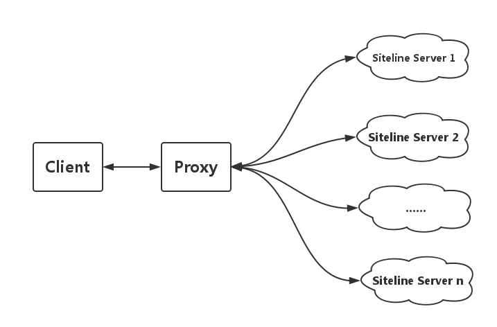

# How to make siteline

## Architecture


## How to communicate between proxy and siteline servers
The proxy pulls messages from siteline servers by HTTP GET method.

###　server info
The following request is used to get the information about the siteline server:
```
http://<ip>:<port>/about
```
The response body is a json object, just like:
```json
{
  "title": "news about sports",
  "abstract": "blabla"
}  
```

### content
The following request format is used to get content(many URLs) from a siteline server:
```
http://<ip>:<port>/content?year=<year>&month=<month>&day=<day>&timezone=<timezone>
```

Here is an example:
```
http://127.0.0.1:5678/content?year=2016&month=5&day=24&timezone=Asia%2FShanghai
```

`year`, `month`, `day`, `timezone` must be given in the query params.It's highly recommended to get more info from http://momentjs.com/timezone . 

The reponse body is a json object, just like: 
```json
{
  "message": "success",
  "data": [
    {
      "url": "http://m.haiwainet.cn/ttc/3541839/2016/0524/content_29948213_1.html?s=toutiao",
      "title": "a title",
      "abstract": "......"
    },
    {
      "url": "http://toutiao.com/group/6287741637398429953/",
      "title": "......",
      "abstract": "......"
    }
   ]
}
```

The `message` field only has two values: `success` and `fail`.

## License
MIT
